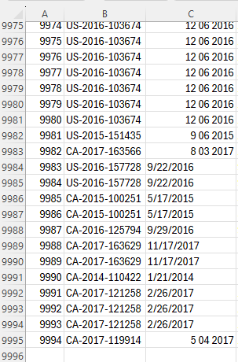
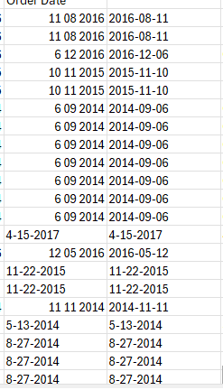
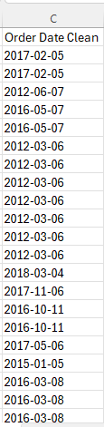
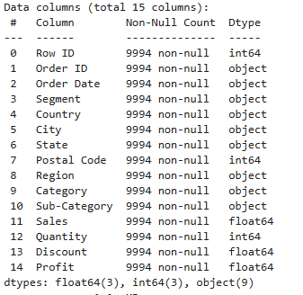
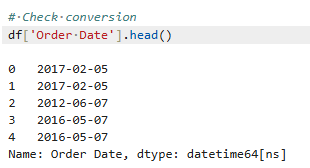
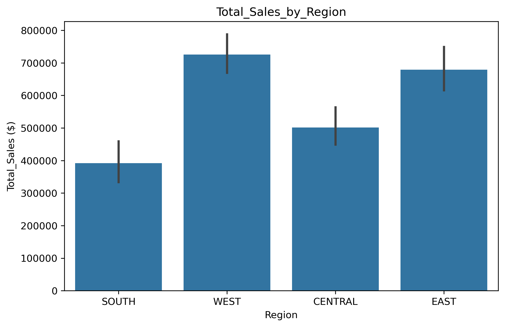

# Retail Sales Performance Analysis 

**Author:** Collins Nosa
**Date:** 2025-08-19

## Background

The Superstore dataset represents a retail chain that sells furniture, office supplies, and technology products across different regions in the U.S. Like many retailers, it faces challenges in balancing sales growth with profitability.

By analyzing past sales data, we can uncover trends in revenue, profit, and customer behavior. These insights will help identify which products and regions drive the most value, where discounts hurt profits, and how the business can make smarter, data-driven decisions to boost performance.

### This project aims to:

* Understand how sales and profits differ across products, regions, and customer types.
* Spot patterns in revenue, discounts, and customer buying behavior.
* Identify what’s working well and where the business is losing money.
* Share practical recommendations to help improve sales and grow profits.

The goal is to turn raw sales data into clear insights that can guide smarter business decisions.

# Step 1: Task Requirements

### Business Task

Determine how sales, profits, and discounts vary across products, regions, and customer segments, so the business can identify growth opportunities, reduce losses, and make smarter decisions to improve overall performance.

### Stakeholders

**Primary:** Sales and Marketing Managers – Need insights on customer behavior, product performance, and discount impact to plan better sales and promotional strategies.

**Secondary:** Finance Team & Executives – Use the findings to guide profitability goals, budget planning, and long-term business strategy.


### Problem Statement
The Superstore wants to grow its profits but doesn’t fully understand which products, regions, or customers drive the most value. At the same time, heavy discounting is cutting into earnings. By digging into past sales data, this project will uncover patterns that show what’s working, what’s not, and how the business can adjust its strategy to boost sales and profitability.

# Step 2: Data Acquisition and Preparation

### Data & Source Integrity

This analysis uses historical sales data from the Superstore dataset, covering multiple years of orders across regions, product categories, sales, profits and discounts. The dataset is available [here.](https://www.kaggle.com/datasets/vivek468/superstore-dataset-final)

### Observations

The Superstore dataset includes thousands of individual sales records, covering orders across multiple product categories, regions, and customer segments. Key columns used in this analysis include:

* **Order ID:** Unique identifier for each order

* **Order Date:** The date when the order was placed by the customer.

* **Product Category & Sub-Category:** Type of product sold (e.g., Furniture, Office Supplies, Technology)

* **Sales & Profit:** Revenue generated and profit earned from each order

* **Discount:** Any discount applied to the order

* **Region & Segment:** Geographical region and type of customer (e.g., Consumer, Corporate, Home Office)


# Step 3: Processing Data (Cleaning and Transformation)

### Tools Used:  

* Excel (Power Querry): for cleaning, filtering, and organizing the sales data.

* Python (Pandas, Matplotlib, Seaborn):  for analyzing the data, calculating key metrics, and creating visualizations to spot trends and patterns.

### Cleaning and Transforming the Data

The retail sales data was originally stored in a raw CSV format and contained inconsistencies in date and text columns. It was imported into Excel for initial cleaning, and the total row count was `9994`.


 
A new column called `Order Date Clean` was created to safely clean the dates without altering the original `Order Date`.
This column was then cleaned and standardized so that all dates follow the same format `(YYYY-MM-DD)`.



### Coverting to proper data
```excel
=TEXT(D2,"yyyy-mm-dd")
```

### Handling 2-digit years and single-digit months/days
```excel
=TEXT(DATE(
    IF(LEN(TRIM(RIGHT(D2,2)))=2,2000+RIGHT(D2,2),LEFT(D2,4)),
    MID(D2,FIND("-",D2)+1,FIND("-",D2,FIND("-",D2)+1)-FIND("-",D2)-1),
    LEFT(D2,FIND("-",D2)-1)
),"yyyy-mm-dd")
```


The `TRIM()` function was applied to text columns such as **Region, Category, and Segment** to remove extra spaces. These columns were also converted to uppercase using `=UPPER()` for consistency.

The **Sales, Profit, Discount, and Quantity** columns were verified to ensure they were in numeric format, and any invalid or missing values were addressed.

Irrelevant columns that were not needed for the analysis, such as **Ship Date, Ship Mode, Customer ID, Customer Name, Product ID, Product Name, City, and State**, were removed to keep the dataset small and focused.


# Step 4: Analysis

### Importing Necessary Libraries

```python
import pandas as pd
import numpy as np
import matplotlib.pyplot as plt
import seaborn as sns
```
###  Loading the .csv dataset and a glimpse at the dataframe

```python
# Loading the .csv dataset
df = pd.read_csv("Retail_Sales_data.csv")

# Taking a glimpse at the dataset
df.head()

# Checking for missing values in each column
df.isnull().sum()

# Checking data types
df.info()
```
###  Data Types
 

###  Converting Order Date to datetime
```python
df['Order Date'] = pd.to_datetime(df['Order Date'], errors='coerce')

# Check conversion
df['Order Date'].head()
```

 

### Creating Month and Year for trend analysis:
```python
# Month and Year for trend analysis
df['Year'] = df['Order Date'].dt.year
df['Month'] = df['Order Date'].dt.month
```

### Sales by Region
```python
plt.figure(figsize=(8,5))
sns.barplot(x='Region', y='Sales', data=df, estimator=sum)
plt.title('Total_Sales_by_Region')
plt.ylabel('Total_Sales ($)')
plt.xlabel('Region')
```


This bar chart compares the total sales across different regions. The West region generates the highest sales, as shown by the tallest bar, indicating it is the strongest market. The South region has the lowest sales, represented by the shortest bar, suggesting potential for growth or additional marketing focus.


### Discount vs Profit by Category
```python
plt.figure(figsize=(10,6))
sns.scatterplot(x='Discount', y='Profit', hue='Category', data=df)
plt.title('Discount vs Profit by Category')
plt.xlabel('Discount')
plt.ylabel('Profit ($)')
```


This scatterplot shows how discounts affect profit for different product categories. Each dot is a sale, and the color represents its category. We can see that higher discounts often reduce profit, and some categories handle discounts better than others. This helps the business understand which product categories can safely offer discounts without hurting profitability too much.

### Sales trend over months
```python
monthly_sales = df.groupby(['Year','Month'])['Sales'].sum().reset_index()
plt.figure(figsize=(10,5))
sns.set_palette("tab10") 
sns.lineplot(
    x='Month',
    y='Sales',
    hue='Year',
    data=monthly_sales,
    marker='o',
    linewidth=2.5, 
    markersize=8 
)
```


This line chart shows how sales change from month to month for each year. Each line represents one year, and the points show total sales for each month. We can see which months have higher or lower sales, helping the business spot seasonal trends and plan promotions or stock accordingly.


### Sales by Segment
```python
plt.figure(figsize=(6,4))
sns.barplot(x='Segment', y='Sales', data=df, estimator=sum)
plt.title('Sales by Segment')
```


This bar chart shows the total sales for each customer segment. Each bar represents a different segment, such as Consumer, Corporate, or Home Office. The taller the bar, the more sales that segment brings in. This helps the business understand which types of customers are contributing the most to revenue and where to focus marketing efforts.

### Heatmap of Sales by Region & Month
```python
# Generating Pivot table for Sales by Region and Month
sales_pivot = df.pivot_table(values='Sales', index='Region', columns='Month', aggfunc='sum')

# Ploting Heatmap for Sales by Region and Month
plt.figure(figsize=(10,5))
sns.heatmap(sales_pivot, annot=True, fmt=".0f", cmap='YlGnBu')
plt.title('Monthly Sales by Region')
plt.ylabel('Region')
plt.xlabel('Month')
plt.savefig("Heatmap_of Sales_by_region_&_month.png", dpi=300, bbox_inches="tight")
```


This heatmap shows total sales for each region across the months. The rows are regions, and the columns are months. Darker colors indicate higher sales, while lighter colors show lower sales. This makes it easy to see which regions perform best in which months and helps the business plan marketing or stock levels seasonally.

### Top 10 Products by Sales
```python
# Sorting top 10 sub-categories by total sales
top_products = df.groupby('Sub-Category')['Sales'].sum().sort_values(ascending=False).head(10)

# Ploting horizontal bar chart
plt.figure(figsize=(8,5))
sns.barplot(x=top_products.values, y=top_products.index)
plt.title('Top 10 Sub-Categories by Sales')
plt.xlabel('Total Sales ($)')
plt.ylabel('Sub-Category')
```


This horizontal bar chart shows the 10 sub-categories that generate the most sales. Each bar represents a sub-category, and the length of the bar shows the total sales amount. The longer the bar, the higher the sales. This helps the business see which products are the best sellers and where to focus marketing or inventory efforts.


# Summarizing Findings

After analyzing the retail sales data, several key patterns emerged that highlight trends across regions, months, customer segments, discounts, and product categories:

1. **Sales by Region:** The West region generated the highest sales, while the South region had the lowest. This suggests the business should focus marketing and operational efforts on high-performing regions while exploring ways to boost sales in lower-performing areas.

2. **Sales Trend Over Months:** Sales fluctuate throughout the year, showing clear seasonal trends. Certain months have higher sales, indicating peak periods, while others are slower. This insight can help with inventory planning and seasonal promotions.

3. **Sales by Segment:** Different customer segments contribute differently to revenue. For example, one segment (e.g., Consumers) may dominate sales, highlighting which segments to target for loyalty programs and marketing campaigns.

4. **Heatmap of Sales by Region & Month:** Combining regions and months shows which areas perform best during specific months. This helps the business plan regional promotions and stock levels seasonally.

5. **Discount vs Profit by Category:** Higher discounts often lead to lower profit, but some categories handle discounts better than others. This insight can guide category-specific discount strategies to maximize profit without hurting sales.

6. **Top 10 Products by Sales:** Certain sub-categories consistently generate the most sales. These top-performing products should be prioritized for inventory management, marketing, and cross-selling opportunities.


# Recommendations

Based on the analysis, here are actionable steps the business could take to increase sales, improve profitability, and optimize operations:

1. **Focus on High-Performing Regions:** Since the West region generates the most sales, prioritize marketing campaigns, stock allocation, and promotions there to maximize revenue. Investigate the South region for opportunities to improve sales, such as targeted advertising or local promotions.

2. **Plan Seasonal Promotions and Inventory:** Use the monthly sales trends to align promotions and inventory with peak months. Increase stock and marketing efforts during high-sales months, and consider special offers to boost sales in slower months.

3. **Target High-Value Customer Segments:** Concentrate marketing and loyalty programs on segments that contribute the most to sales. Tailor campaigns to encourage repeat purchases from these customers while exploring ways to engage lower-performing segments.

4. **Optimize Discounts by Product Category:** Apply discounts strategically, focusing on categories that maintain profitability even with reduced prices. Avoid deep discounts on low-margin products to protect overall profit.

5. **Prioritize Top-Selling Products:** Ensure the top 10 sub-categories with the highest sales are well-stocked and promoted. Highlight these products in marketing campaigns and consider cross-selling complementary items to boost revenue further.

6. **Use Regional and Monthly Insights for Planning:** Combine heatmap insights to optimize stock distribution and promotions by region and month. This ensures high-demand products are available where and when customers are most likely to buy.


 # Conclusion

This analysis highlights key patterns in sales, customer segments, product categories, and regional performance. Understanding which regions, months, and products drive the most revenue helps the business make smarter, data-driven decisions.


By acting on these insights, optimizing inventory, targeting high-value segments, and applying discounts strategically, the business can increase sales, improve profitability, and plan more effectively for the future.
